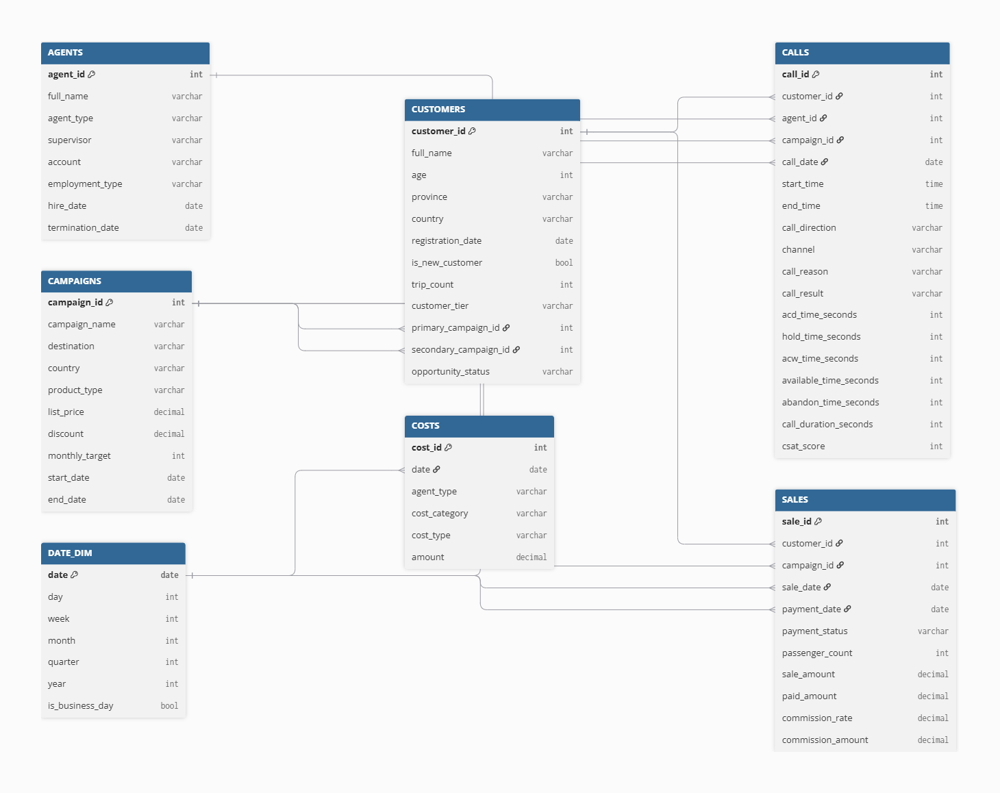
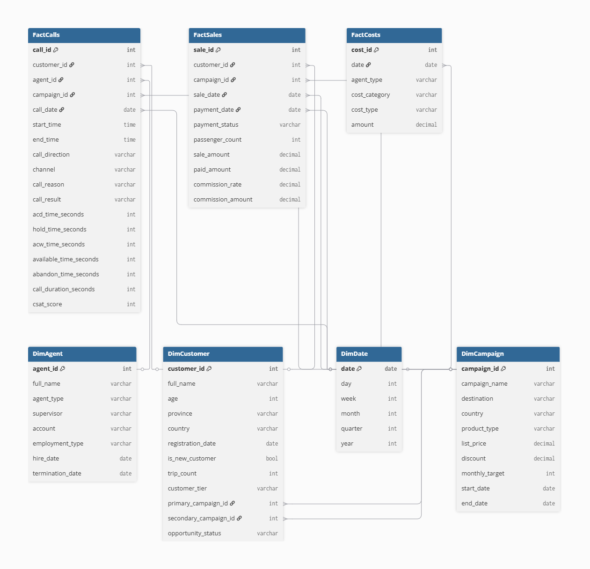

# How much should be automated? A data-driven business decision

A data analytics portfolio project evaluating the operational and financial impact of introducing AI agents into a phone sales operation, under a hybrid human + AI workforce model — and using that evidence to define an optimal automation strategy under budget and quality constraints.

## Table of Contents
- [Overview](#overview)
- [Business Context](#business-context)
- [Business Problem](#business-problem)
- [Objectives](#objectives)
- [Research Questions & Hypotheses](#research-questions--hypotheses)
- [Scope](#scope)
- [KPI Dictionary](#kpi-dictionary)
- [Data Model](#data-model)
- [Tech Stack](#tech-stack)
- [Repository Structure](#repository-structure)
- [Project Status & Roadmap](#project-status--roadmap)
- [Documentation](#documentation)

## Overview

Companies adopting AI-powered conversational agents often frame the decision purely around cost reduction. This project treats it instead as a business decision that has to be backed by evidence: does replacing part of a human sales team with AI agents actually protect (or improve) conversion, customer satisfaction, and profitability — and if so, how far can that replacement go before something breaks?

The analysis is built as an end-to-end BI solution: dimensional data modeling, an ETL pipeline, descriptive and inferential statistics, executive and operational dashboards, and a simplified optimization model that recommends the human/AI mix that maximizes expected profit under real business constraints.

## Business Context

**Contact Solutions** is a fictional contact center provider serving clients across banking, retail, tourism, and professional services, with roughly 2,500 human agents. The company has launched a digital transformation initiative to gradually introduce AI agents into selected accounts.

As a pilot, one of its tourism clients, **Global Experience**, ran a hybrid workforce for outbound vacation package sales over a three-month period: **150 agents total — 141 human, 9 AI**. Operational, commercial, and customer experience metrics were collected throughout, and this dataset is the basis for the analysis.

Management needs to define the AI adoption strategy that maximizes expected business value while staying within a **monthly operating budget of USD 380,000** and maintaining a **minimum CSAT of 85%**, as required by the client.

## Business Problem

Introducing AI agents creates a clear opportunity to cut operational costs, but its effect on conversion, customer satisfaction, and overall profitability is not yet proven. Expanding the hybrid model without evidence risks either damaging key business outcomes or leaving efficiency gains on the table. This project quantifies that impact to support an evidence-based scaling decision.

## Objectives

**General objective:** analyze the operational and commercial impact of gradually introducing AI agents into a phone sales operation, to produce recommendations for expanding the hybrid model within the defined budget and quality constraints.

**Specific objectives:**
1. Characterize current operational, commercial, and quality performance.
2. Statistically compare the performance of human agents vs. AI agents.
3. Propose a gradual adoption strategy backed by quantitative evidence and a simplified optimization model.

## Research questions & hypotheses

**Main question:** What is the most convenient strategy for incorporating AI agents into a phone sales operation to maximize expected profit while balancing profitability, productivity, and service quality?

| # | Question | Type | Hypothesis |
|---|---|---|---|
| Q1 | How does the operation currently perform in terms of productivity, conversion, satisfaction, and profitability? | Exploratory | — |
| Q2 | Are there significant differences in conversion between human and AI agents? | Confirmatory | H2: No significant difference in overall conversion between agent types |
| Q3 | Do AI agents achieve higher average operational productivity than human agents? | Confirmatory | H3: AI agents show higher average operational productivity |
| Q4 | Does introducing AI agents reduce the operational cost per sale vs. human agents? | Confirmatory | H4: AI agents reduce the operational cost per sale |
| Q5 | Which variables are most associated with sales conversion? | Confirmatory | H5: Call duration, campaign type, channel, and agent type are associated with conversion probability |
| Q6 | Are there campaign segments where one agent type outperforms the other in conversion or productivity? | Exploratory | — |
| Q7 | Does profitability depend on the interaction between agent type and campaign type, or on agent type alone? | Confirmatory | H7: Profitability depends more on the agent type × campaign type combination than on agent type alone |
| Q8 | What proportion of human vs. AI agents maximizes expected profit under the budget and CSAT constraints? | Confirmatory | H8: There exists a human/AI mix that maximizes expected profit while simultaneously meeting the budget and CSAT constraints |

## Scope

**In scope**
- Analysis of one phone sales operation, for a single client (Global Experience)
- Comparative performance analysis: human vs. AI agents
- Multi-source data integration via an ETL process
- An analytical model to evaluate operational and commercial KPIs
- Executive and operational dashboards for different decision levels
- Descriptive and inferential statistical analysis on core KPIs
- A simplified optimization model to evaluate AI adoption scenarios
- Recommendations for the hybrid model's expansion strategy

**Out of scope**
- Machine Learning model development or training
- NLP or analysis of call content
- Design or implementation of the AI agents themselves
- Individual customer behavior prediction
- Real-time call routing optimization
- Integration with cloud or production infrastructure

**Constraints:** simulated data, three-month horizon, single client, no learning-curve effects, no seasonality effects, AI costs assumed constant.

## KPI Dictionary

| KPI | Definition | Formula | Level | Goal |
|---|---|---|---|---|
| Conversion Rate | % of effective contacts that end in a sale | Sales / Effective contacts | Strategic | Maximize |
| Profitability | Share of revenue that becomes profit | (Revenue − Costs) / Revenue | Strategic | Maximize |
| Expected Profit | Projected profit of an agent configuration, weighted by conversion probability | (Conversion rate × Margin per sale × Projected contacts) − Fixed costs | Strategic | Maximize |
| Cost per Sale | Total operating cost incurred per closed sale | Operating cost / Sales | Strategic | Minimize |
| Contacts per Agent | Contacts handled per agent in a period | Total contacts handled / Number of agents | Operational | Maximize |
| Sales per Agent | Sales closed per agent | Sales closed / Number of agents | Operational | Maximize |
| Average Handling Time (AHT) | Average duration of a complete interaction | Sum of call duration (sec) / Number of calls | Operational | Optimize |
| Productivity per Hour | Contacts handled per hour worked | Contacts handled / Hours worked | Operational | Maximize |
| Agent Utilization | Share of available time spent effectively on service | Time on call / Total available time | Operational | Maximize (within a reasonable range) |
| CSAT | Average post-call satisfaction score | Average score obtained | Quality | > 85% |
| Complaint Rate | Share of contacts resulting in a formal complaint | Complaints / Contacts handled | Quality | Minimize |
| Abandonment Rate | Share of contacts ending without completing the interaction | Abandoned contacts / Total contacts | Quality / Operational | Minimize |

## Data model

The project uses two data models, reflecting two different stages of the pipeline:

**1. Operational model** — mirrors how the data would realistically arrive from source systems (CRM, telephony/ACD platform, finance), before any BI-oriented transformation.



- [`operational-data-model.dbml`](docs/data-model/operational-data-model.dbml)

**2. Dimensional model** — a star schema (`FactCalls`, `FactSales`, `FactCosts` around `DimAgent`, `DimCustomer`, `DimCampaign`, `DimDate`) designed for the executive and operational dashboards and for efficient DAX/SQL aggregation.



- [`dimensional-data-model.dbml`](docs/data-model/dimensional-data-model.dbml)

**A note on data ownership.** This dataset spans two organizations, not one: **Global Experience** owns the commercial relationship with the end customer (`CUSTOMERS`, `CAMPAIGNS`, `SALES`), while **Contact Solutions** operates service delivery (`AGENTS`, `CALLS`, `COSTS`). That split isn't just a labeling detail — it means the ETL step (Step 5) isn't transforming a single company's data, it's reconciling two source systems that likely differ in refresh cadence, key governance, and data ownership rules.

Read more → [`docs/business-brief.md`](docs/business-brief.md)

## Tech Stack

- **SQL (SQLite)** — data loading and business queries
- **Python (Pandas)** — ETL, descriptive and inferential statistics
- **Power BI** — executive and operational dashboards

## Repository Structure

```
contact-solutions/
├── README.md
└── docs/
    ├── business-brief.md              # Full business brief (context, objectives, hypotheses, KPIs, scope)
    └── data-model/
        ├── operational-data-model.dbml
        ├── operational-data-model.png
        ├── dimensional-data-model.dbml
        └── dimensional-data-model.png
```

As the project advances into ETL, SQL queries, statistical analysis, the optimization model, and dashboards, the corresponding folders (`etl/`, `sql/`, `notebooks/`, `dashboards/`) will be added and documented here.

## Project Status & Roadmap

🚧 **Current stage:** data model design.

| Phase | Deliverable | Status |
|---|---|---|
| 1. Business brief | Company context, problem, objective, stakeholders | ✅ Done |
| 2. Research questions & hypotheses | Main question, secondary questions, hypotheses | ✅ Done |
| 3. Data model design | Star schema and entity-relationship diagram | 🔄 In progress |
| 4. Source data preparation | Main dataset + supplementary Excel defined | ⏳ Pending |
| 5. ETL process | Functional, documented ETL script | ⏳ Pending |
| 6. Data quality validation | Quality rules and validation report | ⏳ Pending |
| 7. SQLite load | Database created and populated | ⏳ Pending |
| 8. SQL queries | Documented business queries | ⏳ Pending |
| 9. Exploratory analysis (Python) | Notebook with statistical analysis and visualizations | ⏳ Pending |
| 10. Optimization model | Mathematical model and scenario analysis | ⏳ Pending |
| 11. Executive dashboard | Dashboard for senior management | ⏳ Pending |
| 12. Operational dashboard | Dashboard for operations | ⏳ Pending |
| 13. Conclusions & recommendations | Executive report with insights | ⏳ Pending |
| 14. Explainer video | Script and recorded walkthrough | ⏳ Pending |
| 15. README & documentation | Portfolio-ready repository | 🔄 In progress |

## Documentation

The full business brief — including stakeholders, detailed scope, and methodology — is available at [`docs/business-brief.md`](docs/business-brief.md).

## About the Author

**Micaela Leguizamon** — Data Analyst with a background in UX Research.

- LinkedIn: [linkedin.com/in/micaela-leguiz](https://www.linkedin.com/in/micaela-leguiz/)
- Portfolio: [micaelaleguiz.framer.website](https://micaelaleguiz.framer.website/)
